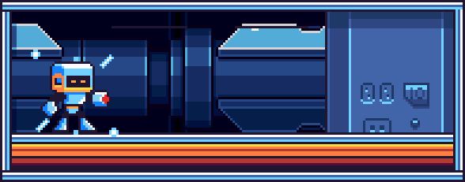

<h1>Matheus Souza de Oliveira</h1>

(Animation made by Nico Pardo, obtained from <a href="https://nicopardo.itch.io/x-reploit-pack">itch.io</a>, under the free tier's non-commercial license.)

 

## 🤖 About Me

- 🧠 **AI Engineer** by trade — I design and ship **LLM-powered data platforms** in **Python**: RAG pipelines, multi-model fallback (OpenAI → Anthropic → Gemini), and skill/taxonomy extraction running on **AWS Lambda/ECS + PostgreSQL**.
- 🔭 Alongside that, I build **fullstack products** with **React / Next.js** and keep a foot in **game dev** with **Godot** and **Blender**.
- 🌱 Currently deepening agentic workflows, embeddings, and cloud infra on **AWS**.
- 💬 Ask me about **LLM integration, RAG, Python, AWS, React, Godot, or Blender**.
- ⚡ Next up: **Golang and Rust**.

 

 

## 🧰 Tech Stack

**AI / Data & Cloud** — *main focus*

  

  
  
  
  

**Fullstack**

  

**Game Dev & Design**

  

**Languages**

  

 

## 📊 GitHub Stats

 

